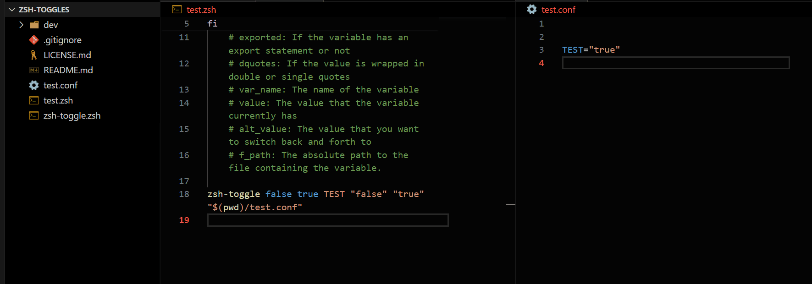

# Zsh Toggles v1.1.0
  
## [Table Of Contents](#table_of_contents)

- [About](#about)
- [Install](#install)
- [Usage](#usage)
- [Contributing](#contributing)
- [Security](#security)
- [Contacts](#contacts)

---

## [About](#about)

Zsh-Toggle is a function that will allow you to toggle the value of a variable in a file.
If you want to let a user turn an option on or off in your program you can do it easily with Zsh-Toggle. 



--- 

## [Install](#install)

To download and install Zsh-Toggle follow these steps

1) Pick a directory to download it to:

```bash
cd where/I/want/
```

2) Paste the following line into your terminal and press the `Enter (^M)` key:

```bash
curl https://github.com/happycod3r/zsh-toggle.git
```

---

## [Usage](#usage)

### Parmeters for zsh-toggle()

- arg1: `EXPORT`
    - [true|false]   
    - Whether the variable has an `export` statement or not. Default is ***'false'***
- arg2: `DQUOTES`    
    - [true|false|none]   
    - Whether the variable has double quotes, single quotes or none. Default is ***'true'***
- arg3: `VAR_NAME`
    - [string]
    - The name of the variable
- arg4: `VALUE`
    - [string]
    - The current value of the variable
- arg5: `ALT_VALUE`
    - [string]
    - The alternte value for the variable
- arg6: `FILE_PATH`
    - [string]
    - The fully qualified path to the file containing the variable

In the file that contains the variable(s) that you want to toggle.
The variable should ...
- be on a line of its own.
- be only one of the following formats: 
  - `$MY_VAR="true"`             no export statement, double quotes
  - `$MY_VAR='true'`             no export statement, single quotes.
  - `$MY_VAR=true`               no export statement, no quotes.
  - `export $MY_VAR="true"`      export statement, double quotes
  - `export $MY_VAR='false'`     export statement, single quotes.
  - `export $MY_VAR=false`       export statement, no quotes.
- be initialized with a value such as true|false, on|off, 1|0, yes|no John|Amy etc.
- It can be any two values that you want to toggle between.

The variable you are toggling should be initialized in its 
file already with either VALUE or ALT_VALUE otherwise it won't work.
For example if you set

```bash
VALUE="yes"
ALT_VALUE="no" 
```

then in the file @ `FILE_PATH` the variable should be initialized 
with either **"yes"** or **"no"**. ex. `MY_VAR="yes"` or `MY_VAR="no"`
The same with the other options too. If you set `DQUOTES` or `EXPORT` to 
**"true"** then the variable value should be wrapped in double quotes
and/or be exported already in the file. Your basically describing the 
variable with these options

### Another example: 

If you call `zsh-toggle` like this

```bash
zsh-toggle false true TEST "false" "true" "$(pwd)/test.conf"
```

then the variable in the file your pointing at with the last argument should look like this:

```bash
TEST="false"
# or
TEST="true"
```

If you call `zsh-toggle` like this

```bash
zsh-toggle true false TEST "on" "off" "$(pwd)/test.conf"
```

then the variable in the file your pointing at with the last argument should look like this:

```bash
export TEST='on'
# or
export TEST='off'
```

You can also call `zsh-toggle` passing `"none"` for the 2nd argument to use no quotes like this:

```bash
zsh-toggle false none TEST "false" "true" "$(pwd)/test.conf"
```

In this case the variable in the file your pointing at with the last argument should look like this:

```bash
TEST=false
# or
TEST=true
```
---

## [Contributing](#contributing)

If you have any feature requests, suggestions or general questions you can reach me via any of the methods listed below in the [Contacts](#contacts) section.

---

## [Security](#security)

### Reporting a vulnerability or bug?

**Do not submit an issue or pull request**: A general rule of thumb is to never publicly report bugs or vulnerabilities because you might inadvertently reveal it to unethical people who may use it for bad. Instead, you can email me directly at: [paulmccarthy676@gmail.com](mailto:paulmccarthy676@gmail.com). I will deal with the issue privately and submit a patch as soon as possible.

---

## [Contacts](#contacts)

**Author:** Paul M.

* Email: [paulmccarthy676@gmail.com](mailto:paulmccarthy676@gmail.com)
* Github: [https://github.com/happycod3r](https://github.com/happycod3r)
* Linkedin: [https://www.linkedin.com/in/paul-mccarthy-89165a269/]( https://www.linkedin.com/in/paul-mccarthy-89165a269/)
* Facebook: [https://www.facebook.com/paulebeatz]( https://www.facebook.com/paulebeatz)

---
